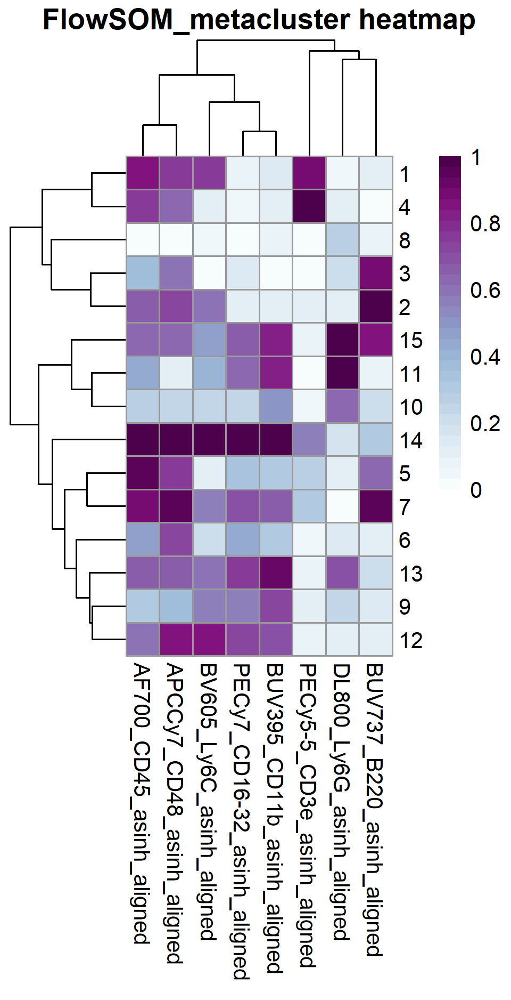
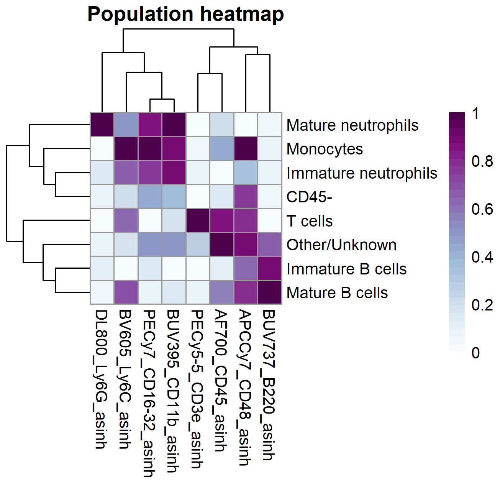
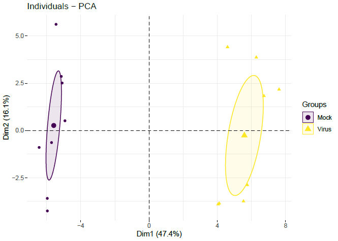
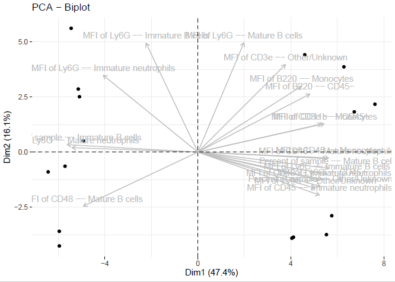

```{r setup, include=FALSE}
knitr::opts_chunk$set(echo = TRUE, warning=FALSE)
```

# What is Spectre?

Spectre is an R package that creates a simple and unified approach to high dimensional analysis of cytometry data. It provides us with tools to perform parameter transformation, batch alignment, dimension reduction, clustering, and differential expression and abundance analysis. 

> Note: Spectre assumes your data have already been cleaned of debris, dead cells, and doublets. Most people will find it easiest to do this using software like FlowJo and exporting cleaned .fcs or .csv files. We will cover manual gating of cytometry data in R in Part 4 of this course.

# Installing and loading the packages

We'll start by installing and loading the Spectre package by installing it directly from GitHub. We also install the *CytoNorm* package from GitHub and the *EnhancedVolcano* package from Bioconductor.

> Remember that `package::function()` is a way of using a function from an installed package without having to load the whole package.

```{r packages}
#install.packages(c("devtools", "BiocManager"))

#devtools::install_github("immunedynamics/spectre")
#devtools::install_github("saeyslab/CytoNorm")
#BiocManager::install("EnhancedVolcano")

library(Spectre)
```

The Spectre package itself relies on a number of other packages to function properly. To check you have these installed, execute `package.check()` and see if it gives an error. If it does, simply install the missing packages the error mentions. 

If all packages are installed, Spectre gives us the convenience function `package.load()` to load all its required packages, rather than us having to load each one individually with `library()`.

```{r package_check, message=FALSE, warning=FALSE}
package.check()
package.load()
```

# Reading in data

For this tutorial, you should have the 16 example .fcs files in the folder `data/clean` from your working/project directory. You can check this using the `list.files()` function as below. You should see the same output as shown here.

```{r list_files}
list.files("data/clean", pattern = "fcs")
```

## The `read.files()` function

To read the data into R, we use the `read.files()` function, giving the file location, the file type (can be ".fcs" or ".csv"), and asking the function to create a column indicating which file each event belongs to. This creates a list of *data.tables*. 

> A data.table is an R data structure similar to a data.frame and a tibble, but is much faster to work with for large datasets. There are some differences in how you work with data.tables, but they still represent tabular data with events on the rows and parameters on the columns.

```{r reading_fcs}
data_list <- read.files(file.loc = "data/clean", 
                        file.type = ".fcs", 
                        do.embed.file.names = TRUE)
```

## Quick summary QC of the data

As a sanity check, we can use the `do.list.smmary()` function to print out some summary information about the data we just read in. This returns a list with three elements:

- the first element is a data.frame showing the column names for each file we read in. This allows us to confirm the files we read in are all labelled the same way (with the same fluorophores and antigens)
- the second element tells us the number of columns in each file. These should all be the same for files from the same experiment
- the third element tells us the number of events in each file. These may vary between files, and allows us to visually check if any files have an unusually low event count.

```{r do_list_summary}
do.list.summary(data_list)
```

## Merging data into master data.table

At present our data are stored as a list of data.tables, but it will be more convenient if we can merge these into a single master data.table. We can achieve this using the `do.merge.files()` function.

```{r}
cell_dat <- do.merge.files(dat = data_list)
```

# Transforming channel values

If your data were exported from FlowJo as *FCS3* or as *CSV - Scale values*, then all the parameters will be linear. In order for our dimension reduction and clustering algorithms to provide meaningful insights, we need to transform our fluorescence/metal parameters. Spectre provides two transformations: asinh and logicle. The asinh (inverse hyperbolic sin) transformation is almost exclusively used for mass cytometry data, while either the asinh or the logicle transformations can be applied to fluorescence cytometry data. You can experiment with different transformations, but for today we will use asinh.
 
## Selecting the transformation and cofactors
First, I start by creating a vector of column names I wish to transform, and then use the `do.asinh()` function to create new variables that have been transformed. The `cofactor` argument is very important here and depends on your data source. If you are working with mass cytometry data then a cofactor of 5 is used ubiquitously. If you are working with fluorescence cytometry data, then cofactors in the range 150 to 250 are more common. You should select a transformation that best resolves "real" clusters of data, without generating artificial clusters around zero.

> Note that the function `do.logicle()` will perform a logicle transformation and will automatically select the cofactors for each channel independently.

```{r vars_to_asinh}
names(cell_dat)
to_asinh <- names(cell_dat)[1:8]
to_asinh

cell_dat <- do.asinh(cell_dat, to_asinh, cofactor = 500) # do.logicle()
transformed_cols <- paste0(to_asinh, "_asinh")
```

## Visualizing the transformation

To check our choice of transformation is suitable, it's a good idea to plot each transformed channel. I start by using the `do.subsample()` function to randomly sample 10,000 events from the data (just to speed things up). Next, I use `lapply()` to apply a function to every element in our transformed_cols vector. The function I apply is an anonymous function that calls `make.colour.plot()` on the data, iterating over each element of the transformed_cols vector as the x variable, and fixing "AF700_CD45_asinh" as the y variable.

> Note: by default, the `make.colour.plot()` function colours the points according to their density, but we could also supply the name of another variable like an antigen, or a grouping variable.

```{r transform_vis}
cell_sub <- do.subsample(cell_dat, 1e4)

lapply(transformed_cols, function(x) {
    make.colour.plot(cell_sub, 
                     x, 
                     "AF700_CD45_asinh",
                     path = "plots",
                     save.to.disk = TRUE)
})
```

After inspecting each of the plots, we may wish to go back and change our transformation. This transformation looks fine, so we'll continue.

# Adding sample metadata

Often, we will have sample metadata we wish to include in our analysis that couldn't read in as part of our .fcs files. This might include sample identifiers and grouping variables such as treatment, concentration, and time. It's easy to add this information to your data.table by manually creating a .csv file with the relevant information, and merging this with your event level data.

In your data/clean/ directory, you should have the file "sample_details.csv" that contains the metadata for this example. If you open the file as a spreadsheet, you"ll see it contains the columns:

- FileName
- Sample
- Group
- Batch

It doesn't need all of these, and could contain more, depending on what variables you want to use to annotate your samples (you could include donor age, for example). 

Once we've read this .csv file we use the `do.add.cols()` function to add this information to our data.table. The first argument is the data we're annotating. The `base.col` argument selects the column in our data.table we will match against the metadata. The `add.dat` argument is the object containing the metadata, and the `add.by` argument is the column in our metadata that will be matched to the `base.col` of our data.table. The function adds the new metadata columns, then iterates over each event (row) in our data.table, finds the row of our metadata that matches the row's `base.col` value (usually the FileName column) and fills in the values of the new columns with the values for this row.

In this example, this results in each event being given values for the new Sample variable (just a shorter alias for each sample), Group variable, and Batch variable. Later, this will allow us to perform batch normalisation, separately plot different treatment groups, and perform statistical inference on the differences between groups.

```{r metadata, message=FALSE, warning=FALSE}
meta_dat <- read.csv("data/clean/sample_details.csv")
meta_dat

cell_dat <- do.add.cols(cell_dat, 
                        base.col = "FileName", 
                        add.dat = meta_dat, 
                        add.by = "FileName")

cell_dat
```

# Batch alignment

If samples were not all stained and collected together, it's possible that batch effects exist in the data that contribute added noise. Preventing batch effects before they occur is the best strategy, but if samples must be collected at distant time points, then we can mitigate their impact by including a common sample to each round of staining and acquisition, and using the CytoNorm algorithm to align the batches based on these *batch control* files.

## Preparing the batch control data

We start by defining what files represent the batch controls (we should have as many files as there are batches), and using the `do.filter()` function to create a second data.table containing only the batch control data.

```{r batch_samples}
reference_files <- c("Mock_01_A", "Mock_05_B")
reference_dat <- do.filter(cell_dat, "Sample", reference_files)
```

The cytonorm algorithm relies on first clustering the data so that each cluster can be aligned separately. The function `prep.cytonorm()` does this first step. We can set the number of metaclusters manually or let the algorithm decide for itself. The arguments `cellular.cols` and `cluster.cols` allow us to separately specify markers for alignment and for clustering, respectively. In this example, we use the same markers for both.

```{r prep_cytonorm, message=FALSE, warning=FALSE}
cytonorm <- prep.cytonorm(dat = reference_dat,
                          cellular.cols = transformed_cols,
                          cluster.cols = transformed_cols,
                          batch.col = "Batch",
                          sample.col = "Sample") 
```

Before we proceed, lets perform a UMAP embedding of the batch control files to see whether they do require alignment. As UMAP on a large dataset can take minutes to run, let's first randomly sample 10,000 events from the clustered control sample data (accessed using `cytonorm$dt`). We then run the UMAP using `run.umap()`, using the columns we defined earlier.

```{r pre_align_umap, message=FALSE, warning=FALSE}
cytonorm_sub <- do.subsample(cytonorm$dt, 1e4)
cytonorm_sub <- run.umap(cytonorm_sub, use.cols = transformed_cols)
```

We use `make.colour.plot()` to plot the two UMAP dimensions against each other, colouring by the Sample variable (setting `col.type = "factor"` so it doesn't colour it as a continuous variable).

```{r pre_aling_plot}
make.colour.plot(cytonorm_sub, 
                 "UMAP_X", 
                 "UMAP_Y", 
                 col.axis = "Sample", 
                 col.type = "factor", 
                 path = "plots")
```

As you can see, the two batch control files have an offset from each other and are not aligned. This suggests batch alignment is required. We can reproduce the plot above but this time colouring by FlowSOM metacluster. If we felt the data had been grossly over or under clustered, we could repeat the `prep.cytonorm()` step, setting the argument `meta.k` to whatever we like.

```{r pre_align_clust}
make.colour.plot(cytonorm_sub, 
                 "UMAP_X", 
                 "UMAP_Y", 
                 col.axis = "prep.fsom.metacluster", 
                 col.type = "factor", 
                 path = "plots")
```

The clustering here doesn't need to uncover fine biological detail, just to separate the main cell types, so this is fine.

## Training the CytoNorm model

Now our data are prepared for the CytoNorm algorithm, we train the model using `train.cytonorm()`. This function takes each metacluster, and learns (potentially) non-linear relationships between the level of each marker in each batch control file, and the mean of all the control files for that marker.

```{r train_cytonorm, message=FALSE, warning=FALSE}
cytonorm <- train.cytonorm(model = cytonorm, align.cols = transformed_cols)
```

## Aligning the data

Now that our CytoNorm model is trained, we can use it to align the data and add these columns to our data.table, using the `run.cytonorm()` function. This function identifies what batch each event belongs to (based on the Batch column we added with our metadata), then applies the transformation for each marker learned during the training step above.

> Note: the added columns with the aligned data have "_aligned" appended to their name, so we make a new vector of names called aligned_cols, by `paste0()`ing together the original column names with "_aligned".

```{r message=FALSE, warning=FALSE}
cell_dat <- run.cytonorm(dat = cell_dat, model = cytonorm, batch.col = "Batch")
aligned_cols <- paste0(transformed_cols, '_aligned')
```

## Visualising the alignment

Let's do a high-level check of the batch alignment by computing and plotting a UMAP embedding using the aligned columns, on the batch control files.

```{r message=FALSE, warning=FALSE}
reference_dat <- do.filter(cell_dat, "Sample", reference_files)
reference_sub <- do.subsample(reference_dat, 1e4)
reference_sub <- run.umap(reference_sub, use.cols = aligned_cols)

make.colour.plot(reference_sub, 
                 "UMAP_X", 
                 "UMAP_Y", 
                 col.axis = "Batch", 
                 col.type = "factor", 
                 path = "plots")
```

Woohoo! Now we can see that our two batch control files line up with each other.

# Clustering 

To help us identify clusters or populations of cells in our data, we can employ a clustering algorithm to partition the rows of the data.table into groups that are more similar to each other than they are to rows in other groups. Traditional gating is just "clustering by hand", but can be subjective and miss important populations when the parameter space is large.

At present, the Spectre package comes with three popular clustering algorithms:

- FlowSOM
- Phenograph
- Chronoclust

FlowSOM and phenograph are state of the art and perform well for most cytometry clustering problems. Chronoclust is designed to find and track clusters through different time points. In this example we will use FlowSOM, but you can run phenograph using `run.phenotgraph()`.

Performing FlowSOM clustering is easy: we simply provide the name of the data object, the columns we wish to use for clustering, and the number of metaclusters (meta.k) we wish to partition the data into, to the `run.flowsom()` function. If you leave the meta.k argument blank, the algorithm will try to determine an optimal number, but it is usually best to set this a little higher than the number of populations you think may be identifiable in the data. We can alter the number of metaclusters later if we believe we are under or over clustering.

> Note: sometimes you may get more identifiable clusters by only using cell type markers (rather than functional markers). Clustering only on cell type markers doesn't stop us from analysing the abundance of our functional markers later in the analysis.

```{r flowSOM, message=FALSE, warning=FALSE}
cell_dat <- run.flowsom(cell_dat, aligned_cols, meta.k = 15)
```

# Dimension reduction

To help visualise gross differences between our groups, and to help us identify if we are under or over clustering our data, it's useful to compute and plot a lower-dimensional embedding of our data. 

At present, the Spectre package comes with four popular dimension reduction algorithms:

- UMAP
- t-SNE (Barnes-Hut)
- Fourier-interpolated t-SNE (FIt-SNE)
- Principal components analysis (PCA)

UMAP and t-SNE are state of the art, with FIt-SNE being considerably faster than the Barnes-Hut t-SNE. PCA allows us to perform linear dimension reduction, so isn't very good for identifying groups of events in high dimensional data, but is useful for identifying groups of samples.

## Performing a UMAP embedding

Let's perform a UMAP embedding. As UMAP can take minutes on very large datasets, it's common to first randomly sample a smaller number of rows from the data. When first exploring the data, it's good to start small, and to repeat the embedding with a larger number of events once you are happy with your analysis. To perform the UMAP, we just execute `run.umap()` with the sampled data as the first argument, and the columns we wish to use as the second argument.

> Note: similar functions `run.tsne()`, `run.fitsne()`, and `run.pca()` are used to perform t-SNE, FIt-SNE, and PCA, respectively.

```{r umap, message=FALSE, warning=FALSE}
cell_sub <- do.subsample(cell_dat, targets = 1e4)
cell_sub <- run.umap(cell_sub, aligned_cols)
```

## Plotting the data in the lower-dimensional space

Let's plot the two UMAP dimensions against each other to visualise the embedding. First, we colour the dots based on their FlowSOM metacluster, telling the `make.colour.plot()` function that the variable we're colouring by is a factor (rather than continuous). The `add.label = TRUE` argument adds text labels to the plot to identify the centre of each cluster.

```{r umap_by_cluster}
make.colour.plot(cell_sub,
                 "UMAP_X",
                 "UMAP_Y",
                 col.axis = "FlowSOM_metacluster",
                 col.type = "factor",
                 add.label = TRUE,
                 path = "plots")
```

Let's reproduce the same plot, but this time let's split the data from our treatment groups across different plots, by using the `make.multi.plot()` function.

```{r umap_by_group}
make.multi.plot(cell_sub, 
                "UMAP_X", 
                "UMAP_Y", 
                plot.by = "FlowSOM_metacluster", 
                divide.by = "Group", 
                col.type = "factor",
                dot.size = 0.5,
                path = "plots")
```

Finally, to help us assign cell types to our clusters ("annotating" the clusters), let's plot the UMAP embeddings, but faceting by antigen, and colouring by expression of that antigen.

```{r umap_by_expression}
make.multi.plot(cell_sub, 
                "UMAP_X", 
                "UMAP_Y", 
                plot.by = aligned_cols,
                path = "plots")
```

# Annotating our clusters

The process of assigning a biological cell type to each cluster is usually the hardest and most labour intensive part of the analysis. To help with this, in addition to the UMAP plots we created a moment ago, it can be useful to create an expression heatmap for all the clusters. This is a heatmap where rows represent FlowSOM metaclusters, columns represent antigens, and the colour of each tile represents the median expression value.

First, we need to compute the median expression value for each antigen, for each metacluster. Computing a statistic on a per-group basis is called *aggregating* the data, and we can do this using Spectre's `do.aggregate()` function.

Once we've computed the medians, we use the function `make.pheatmap()` (notice the p) to generate the heatmap. The medians we calculated are the first argument, followed by the column we wish to divide the heatmap rows by (`sample.col`), and the column we wish to divide the heatmap columns by (`plot.cols`).

```{r metak_heatmap}
medians <- do.aggregate(cell_dat, aligned_cols, by = "FlowSOM_metacluster")

make.pheatmap(medians, 
              sample.col = "FlowSOM_metacluster", 
              plot.cols = aligned_cols,
              path = "plots")
```

{ width=50% }

Armed with our UMAP plots and our expression heatmap, now we need to start assigning cell types to our FlowSOM metaclusters. Note that it's better to over cluster than to under cluster, as at this point we can merge clusters we believe represent the same cell type. 

To annotate, we create a list of vectors, where the name of each element is the name of the cell type, and the elements of each vector are the metacluster(s) to be assigned to that cell type.

Once we have created our list, the `do.list.switch()` function will convert it into a data.table for us, where the first column contains the metacluster numbers, and the second column contains the cell types. Just for convenience, we rename the columns to "Values" and "Population", respectively.

```{r annotation}
annots <- list("T cells"             = c(1, 4),
               "CD45-"               = c(6, 8, 10),
               "Immature B cells"    = 3,
               "Mature B cells"      = 2,
               "Monocytes"           = c(12, 14),
               "Mature neutrophils"  = c(11, 13),
               "Immature neutrophils"= 9,
               "Other/Unknown"       = c(5, 7, 15)
               )

annots <- do.list.switch(annots)
names(annots) <- c("Values", "Population")
annots
```

Let's add a new column to our data.table indicating the annotated population of each event. We can do this using the `do.add.cols()` function just like we did when we added metadata to our data.table. As a reminder: the first argument is our master data.table, the `base.col` argument is the column in that data.table we'll match our new data against, the `add.dat` argument is the data.table containing our annotations, and the `add.by` argument is the column in the annotations containing the metacluster numbers (to match against the metacluster numbers in the master data.table).

```{r add_annotation, message=FALSE, warning=FALSE}
cell_dat <- do.add.cols(cell_dat, 
                        base.col = "FlowSOM_metacluster", 
                        add.dat = annots, 
                        add.by = "Values")
cell_dat
```

So we can create a nice UMAP plot labelled with our cell types, let's do the same for the cell_sub data.table, then plot the UMAP embedding with the cell type labels.

```{r annotated_umap, message=FALSE, warning=FALSE}
cell_sub <- do.add.cols(cell_sub, 
                        base.col = "FlowSOM_metacluster", 
                        add.dat = annots, 
                        add.by = "Values")

make.colour.plot(cell_sub,
                 "UMAP_X",
                 "UMAP_Y",
                 col.axis = "Population",
                 col.type = "factor",
                 add.label = TRUE,
                 path = "plots")
```

Lastly, let's recreate our expression heatmap using our annotated cell types as rows, instead of the metaclusters.

```{r annotated_heatmap, message=FALSE, warning=FALSE}
medians <- do.aggregate(cell_dat, transformed_cols, by = "Population")

make.pheatmap(medians, "Population", transformed_cols, path = "plots")
```



# Exporting the data

Now that our original .fcs data are combined and annotated with the metadata and population data, it's a good idea to save the master data.table so we can come back to where we left off in future. We do this using the `write.files()` function from Spectre. By default it will save one massive file, but we can use the `divide.by` argument to split it into individual files based on the values of a column. Here, I split by Sample. We can export the data as .csv, .fcs, or both.

```{r write_files}
write.files(cell_dat,
            file.prefix = "data/annotated",
            divide.by = "Sample",
            write.csv = FALSE,
            write.fcs = TRUE)
```

# Statistical analysis

So far we have partitioned our dataset into populations of cells. Now what? The next step in your analysis will depend on the questions you are asking, but a general starting point is to generate summary statistics of our data that include:

- the proportion of all events in each population
- the median fluorescence/mass intensity (MFI) of each antigen within population

## Generating summary statistics

We can generate all of this in Spectre with the `create.sumtable()` function. First though, I find at this point in the analysis my column names have become long and cumbersome to plot, so I replace them with simple names.

```{r simplify_names}
simple_names <- c("CD3e", "CD16-32", "Ly6G", "CD45", "CD48", "CD11b", "B220", "Ly6C")
names(cell_dat)[22:29] <- simple_names
```

To the `create.sumtable()` function, I give the data.table as the first argument, and the columns that indicate the Sample and Population of each event to the `sample.col` and `pop.col` arguments, respectively. I use the `use.cols` argument to specify what antigens I want MFIs calculated for, and the `annot.cols` argument to specify columns with additional metadata I want to be included in the summary data.table.

```{r sumtable, message=FALSE, warning=FALSE}
sum_dat <- create.sumtable(dat = cell_dat,
                           sample.col = "Sample",
                           pop.col = "Population",
                           use.cols = simple_names,
                           annot.cols = c("Group", "Batch"))

names(sum_dat)
```

## Plotting heatmap of summary statistics

One option to visualise the summary statistics we just generated is to use a heatmap. With a large number of antigens and/or populations, this heatmap can grow large and hard to read, but we'll generate one anyway and see how we can filter it down to more interesting variables.

As we have percentages, and MFIs from highly and weakly-expressed antigens, we first need to transform our summary statistics into z-scores (into units of standard deviation). Once we define what variables we want to transform, we can do this using the `do.zscore()` function. 

> Note: The argument `replace = TRUE` just means the transformed data replace the untransformed data, rather than creating new columns.

```{r z_score}
plot_cols <- names(sum_dat)[4:75]
sum_dat_z <- do.zscore(sum_dat, plot_cols, replace = TRUE)
```

To draw the heatmap, we use the `make.pheatmap()` function, just like we did earlier. If you set the argument `is.fold = TRUE`, the tiles will be coloured based on their fold difference from the mean of that column. To add any metadata for each sample to the plot, we supply them as a vector of column names to the `annot.cols` argument. The `dendrogram` argument allows us to hierarchically cluster (and draw the dendrogram) the "column", "row", or "both" (the default).

```{r zscore_heatmap, message=FALSE, warning=FALSE}
make.pheatmap(sum_dat_z,
              sample.col = "Sample",
              plot.cols = plot_cols,
              is.fold = TRUE,
              annot.cols = c("Group", "Batch"),
              dendrograms = "column",
              path = "plots")
```


## Principal component analysis of samples

We can use PCA to see if our groups of samples partition separately from each other when projected onto the first two principal components. We can perform this in Spectre using `run.pca()` as below. The argument `group.ind` lets us specify a grouping variable, and setting `plot.ind.group = TRUE` draws 95% confidence ellipses around each group. Setting the argument `scree.plot = FALSE` just stops the function from asking you to select the number of components you're interested in (doesn't matter for the plots).

> Note: for some reason, this function dumps quite a lot of output both in your working directory, and in the directory you specify as the `path` argument.

```{r pca, message=FALSE, warning=FALSE}
run.pca(sum_dat, 
        use.cols = plot_cols,
        group.ind = "Group",
        plot.ind.group = TRUE,
        scree.plot = FALSE,
        path = "plots/PCA"
)
```




## Pairiwse comparisons

To identify summary statistics that are unlikely to be the same across our groups, we can perform pairwise Mann-Whitney U tests (non-parametric equivalent of t test) and compute fold changes and false discovery rate (FDR)-corrected p values. The function `create.stats()` will do this all for us where the first argument is the data.table of summary statistics (not the z scores). The `use.cols` argument lets us choose the summary statistics to compare, `sample.col` and `group.col` arguments are the columns that identify each sample and group, respectively. The `comparisons` argument let's us specify a list of 2-element vectors, where each vector identifies a pair of Groups we want to compare. In this example, we only have two groups, Mock and Virus.

> Note: I've shown the argument `corrections = "fdr"` here so the correction is transparent, but this is the default (and only for now) value.

```{r create_stats}
stats_tab <- create.stats(sum_dat, 
                          use.cols = plot_cols,
                          sample.col = "Sample",
                          group.col = "Group",
                          comparisons = list(c("Mock", "Virus")),
                          corrections = "fdr")

stats_tab[, 1:3]
```

This creates a data.table with 2 rows for each comparison (one with Log2 fold change, the other with the FDR-corrected p value), and a row for the p value of the omnibus test (Kruskal-Wallis). Except the first two, each column represents one of the summary statistics we passed to the `create.stats()` function.

We can visualise the log2 fold change against the p values using a volcano plot. To construct the volcano plot, we first need to extract the fold changes and p values form the stats_tab data.table. I do this below, using `[` to subset the first row for the fold change and the second row for the p values, and dropping the first two columns. This operation returns a data.table with a single row in each case, so to turn these into vectors we can just wrap them inside the `unlist()` function.

```{r extract_fc_and_p}
FC <- unlist(stats_tab[1, c(-1, -2)])
p_values <- unlist(stats_tab[2, c(-1, -2)])
```

Now, let's combine these into a neat data.frame (we could also use a data.table if we wanted), including a column for the variable names.

```{r stats_df}
stats_df <- data.frame(FC = FC, p_values = p_values, vars = plot_cols)
head(stats_df)
```

Now, to make our volcano plot we use the `make.volcano.plot()` function, supplying the p values and log2 fold change values as the first and second arguments, respectively.

```{r volcano_plot, message=FALSE, warning=FALSE}
make.volcano.plot(p_values,
                  FC, 
                  vars = as.character(1:72), 
                  title = "Mock vs Virus",
                  xlim = c(-4, 4),
                  path = "plots")
```

## Filtering comparisons of interest

Let's focus in on comparisons with fold changes and p values above certain thresholds. Let's define any feature having a (FDR-corrected) p value smaller than 0.05, and having a log2-fold change value >= 0.26 (this corresponds to a fold change of ~1.2), as of interest.

Next, we extract a vector of features that meet these criteria, and remove any with missing values (happens when the values of a particular feature are all 0). Now, re plot our heatmap again, but this time we only include the filtered features based on our statistical analysis.

```{r filtering_volcano}
fold_filter <- abs(stats_df$FC) >= 0.26
p_filter <- stats_df$p_value < 0.05

stats_filtered <- stats_df[fold_filter & p_filter, ]$vars
stats_filtered <- stats_filtered[!is.na(stats_filtered)]

make.pheatmap(sum_dat_z,
              sample.col = "Sample",
              plot.cols = stats_filtered,
              file.name = "Pheatmap by sample filtered.png",
              is.fold = TRUE,
              annot.cols = c("Group", "Batch"),
              dendrograms = 'both',
              path = "plots")

```


