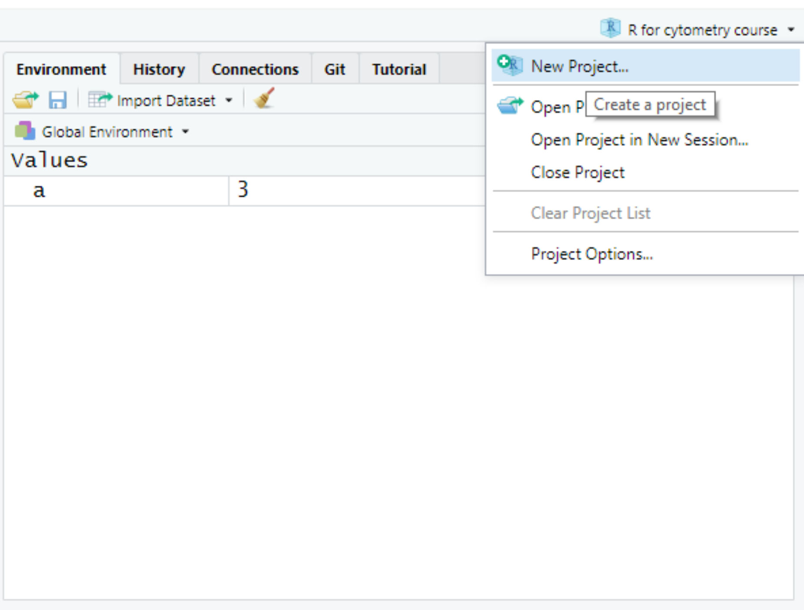
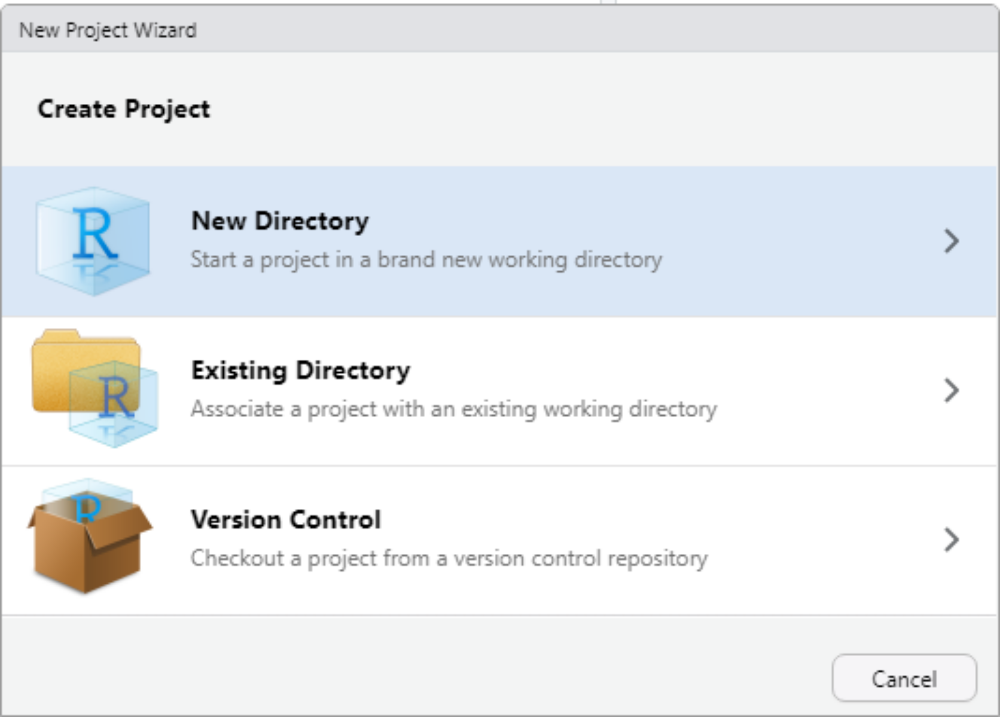
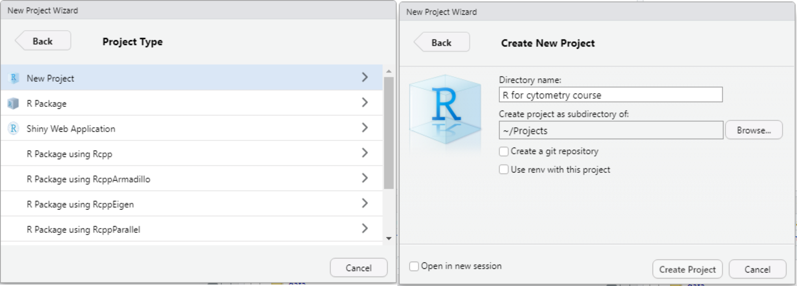

```{r include = FALSE}
knitr::opts_chunk$set(eval = FALSE)
```

# What is R and what is RStudio?

R is a statistical programming language that allows you to analyse and plot virtually any kind of data with complete flexibility. RStudio is a program called an *integrated development environment* (IDE), that just gives you some additional tools to make programming in R easier. When working on an R project, most people will use RStudio (or another IDE).

# Navigating RStudio
## The console

When you open RStudio, you'll be presented with a graphical user interface that is split into four main areas as shown in Figure 1. The console is a direct interface to the R language: if you type something in this box and hit `Return`, R will immediately run that code. This is useful for testing things out, but if you want to keep track of code you want to keep and re-use, you should type it into the script instead. 

## The script

The script is just like a text editor. You type your code here line by line, and you can save a script you're working on (as a .R file) and reload it, or share it with others. You can either run a script all at once, or you can run just the current line by hitting `Ctrl + Return`. You can have multiple scripts open at the same time, and these will be shown as different tabs.

## The Environment and History tabs
When you run code that stores data as objects (more on this later), you can see these objects listed in the Environment tab. This helps you keep track of what objects you currently have available to you. Clicking on the History tab allows you to read through code you have previously run (you can do the same by pressing the up key when in the console).

## The Files, Plots, and Help tabs
The Files tab shows you the files and folders in your current working directory (the directory R will look in when you ask it to look for and save files). You can use this view to navigate the folders and open files. The Plots tab will display the most recent plot you have asked R to create. The Help tab is where you'll find information on how to use functions (more on this later).

<center>

![Figure 1: The RStudio window layout. The console is where your R code is executed. The script is where you can write R scripts that can be saved and reloaded. The Environment tab tells you what objects and data are currently in your working environment. The History tab lets you browse commands you have previously run. The Files tab lets you see files and navigate folders from your working directory. The Plots tab displays any plots you've created, and the Help tab is where you'll find instructions on running R functions.](graphics/RStudio layout.png)

</center>
# Creating a project

When you start working on a new project or new experiment. It's optional but recommended to create an RStudio project. Using a project has two benefits:

- when you reopen a project at a later date, all the files you had open when you last closed the project will be automatically opened
- creating a project automatically sets your *working directory* to the project folder so you don't have to set it manually

In R, your working directory is the folder on your computer that R will look in when you ask it to read and write files. For example, if your working directory is `/home` and you have a file called my_data.csv in the directory `/home/data`, trying to read the file with `read.csv("my_data.csv")` will give an error, because this file doesn't exist in your working directory. Instead, you would need to specify the relative file path from the working directory, like this: `read.csv("data/my_data.csv")`. We'll cover reading files into R later, so don't worry too much about this for now.

To create a new R project, click on the Projects menu in the top right corner, and click *New Project...*.

<center>

{width=50%}

</center>

A window will pop up asking you if want to create a new folder for your project, or place the project into an existing one. The choice is yours.

<center>

{width=50%}

</center>

In the next window select *New Project*, then decide on a name for your project (up to you but it should help you identify the project/experiment). If you chose to create a new directory, you can specify its parent directory. Once you're happy, click *Create Project*.

> If you are familiar with the git version control system, you can create your project as a git repository using the tick box. If you're familiar with package environments (as in Anaconda), you can choose to use the renv environment management system with this project. If neither of these things are familiar to you, leave these check boxes blank.

<center>



</center>

# R is a glorified calculator

R is designed to help you perform potentially complex mathematical operations and simulations, but it's easy to use it for basic arithmetic. Try typing each of the following commands into the terminal, and hit `Return` to execute them.

```{r calculator, results='hide'}
2 + 2             
7 - 8
4 * 6
144 / 12
8 ^ 9
2 + 2 * (2 ^ 6) # this is a comment
```

After each command, you should see `[1]` followed by the answer, printed to the console. 

> Note that in R, anything after `#` on a line is a comment, and is not interpreted by R. This allows you to write human readable comments explaining what you did and why.

If you want to re-run or edit a command you previously entered, tap the up key on your keyboard with your cursor in the console. Keep tapping up to track back through your command history.

# Using the script

While the console allows you to execute R code directly, it doesn't offer a convenient way of storing and editing your code. For this, we use the script. To create a new R script, either click *File > New File > R Script*, or click on the icon of a white sheet with a + symbol on it, just below the *File* button, and select *R Script*. A blank script should open, and we will type our code into the script from now on. 

When we wish to execute code from the script, place your cursor on the line you wish to execute, and press `Ctrl + Return`.

Try typing `8 * 6` into the script and pressing `Ctrl + Return`, you'll see this line of code is passed to the console where it is interpreted by the R language.

> Top tip: you can quickly create headings in your R script by pressing `Ctrl + Shift + R`. This opens a box that allows you to type the name of a heading in your script. This is especially useful for navigating large scripts with hundreds of lines.

# Objects

You can store the result of some kind of computation in R as an object, so that you can call the result later in the script.

## Creating objects

In R we use the `<-` operator to assign the value on the right of the arrow, to an object name on the left (you can also use `=` if you prefer, but `<-` is "traditional"). To reuse the value stored in the object, we simply call the object. Note that R is case sensitive and that `a` is not the same as `A`!

```{r create_objects}
a <- 10 * 6
a

A <- 2 + 6 # CASE SENSISTIVE

A
a
```

The value of an object can be overwritten by simply assigning a different value to the same object name (no warning is given).

```{r overwriting objects}
a <- 0
a
```

## Naming objects

How you name your objects is up to you, but there are some rules and recommendations. Firstly, you cannot start an object name with a number or punctuation character, and you should avoid punctuation characters anywhere in the name, with the exception of dots (.) and underscores (_). Object names should be a reminder of what value the object stores, so `elisa_data` is a better name than `x` for the same values. When you want your object to have two words in its name, the most common approaches are to use underscores to separate the words (known as snake case), or to capitalise the first letter of each subsequent word (known as camel case). Which you use is up to you, just remember to be consistent, and that R names are case sensitive. Try the naming options below. Can you predict which will result in an error?

```{r naming_objects, eval = FALSE}
1object <- 3
!object <- 3
-object <- 3
object1 <- 3
object! <- 3
my.object <- 3
my_object <- 3
myObject <- 3
```

> If you want to remove an object to de-clutter your environment, you can use `rm(object)`.

# Data classes

R can handle a variety of types of data, and categorises different data types into data *classes*. There are a few classes to be aware of, because R will treat these classes differently in different circumstances. These are:

- numeric (integers and decimal numbers)
- character (can contain letters and special characters)
- logical (can only be TRUE or FALSE)

R is usually able to tell what class a particular value should be. Run the code below to see what class each of the values belongs to:

```{r data_classes}
class(12.6)
class("cytometry")
class(TRUE)
```

So far we've only looked at data one value data time, but we usually need a way of storing and manipulating large amounts of data at the same time. We can do this using R's *data structures*.

# Data structures

When we have multiple values or a table of values to work with, we can store them in one of a few different data structures in R. The first and most simple of which is the atomic vector (or just vector).

## Vectors

A vector is a set of values, all of the same class (so all numeric, all character, or all logical). We create a vector by typing `c()`, and placing each value inside the brackets, separated by commas. The examples below show the creation of vectors of varying lengths and classes. Vectors can be any length, and we can store them as objects.

> Note that `1:10` is a shorthand for `c(1, 2, 3, 4, 5, 6, 7, 8, 9, 10)`

```{r vectors}
c(1, 2, 3, 4, 5, 6, 7, 8, 9, 10)
c(1:10)
c("Mon", "Tue", "Wed", "Thur", "Fri")
c(Mon, Tue, Wed, Thur, Fri)           # CHARACTER STRINGS MUST BE IN QUOTES
c(FALSE, TRUE, TRUE, FALSE, FALSE)
c(false, true)                        # LOGICAL MUST BE IN CAPITALS
my_vector <- c(F, F, F, T, T)          # BUT CAN BE ABBREVIATED
my_vector
```
When we perform arithmetic with vectors, the operation is applied element-wise to every element in the vector.

```{r vector_arithmetic}
numbers <- c(1:10)
numbers * 2                           
numbers + 3
numbers + numbers
```

This is only possible because the elements of a vector must all be of the same class. If you need a more flexible way to store data values, you can use lists instead.

## Lists

A list, just like a vector, is a data structure that holds a set of values, with the difference being that the elements of a list don't have to be of the same class. For example, you can mix numeric and character elements, and you can even have vectors and lists inside lists! Here are some examples below:

```{r lists}
list(1, 2, 3, "hello", FALSE)
list(my_vector, 1, 2, 3, "hello", FALSE) # LISTS CAN CONTAIN LISTS AND VECTORS
list(my_vector, c(1, 2, 3), "hello", FALSE)
```

Beginners tend not to make heavy use of lists, but the more you program, the more useful they will become.

## Data.frames

In science we're often used to working with tabular data where each column is a variable and each row is an observation. This is the way we store data in a spreadsheet, for example. The main data structure for handling this kind of data is the *data.frame*. A data.frame can have columns of different data classes, but the class within each column must be the same. In this way, it's helpful to think of each column of a data.frame as a vector.

We will make heavy use of data.frames later, but for now let's look at how we can subset vectors and lists.

## Subsetting vectors

Sometimes you have a vector of values, but you only want to use a subset of them, not the whole vector. We can subset vectors in R using a single set of square brackets (`[]`). We simply place the index or a vector of indices inside the square brackets, for the elements we wish the extract.

> Note that subsetting with a negative index, drops that element.

```{r subsetting_vectors}
days <- c("Mon", "Tue", "Wed", "Thur", "Fri")
days
days[1]
days[4]
days[c(1, 3, 4)]
days[1:4]
days[-5]
```

## Subsetting lists

Subsetting lists is similar to subsetting vectors, except that you should use double square brackets (`[[]]`) with the indices of the elements you want. If the element is a vector, you can further subset this vector by also using single square brackets.

> Note that if the elements of the list are named (as in the example below), elements can be extracted either by their index, or by name.

```{r subsetting_lists}
my_list <- list(a = 1:3, b = TRUE, c = "laser")
my_list[[1]]
my_list[["a"]]
my_list[["a"]][2]
```

# Functions

The main way you apply complex operations on data in R is by using *functions*. A function is an R object that takes some input, and outputs the result of some computation. You know something is a function, because you will use it by calling its name, followed by a pair of round brackets (e.g. `mean()`). Any inputs, known as *arguments*, to the function go inside the brackets.

## Using functions

There are many built-in functions for a wide variety of tasks in R. Some important examples are shown below.

> Note that some functions return single values only, while others return a value for each component of the input

```{r example functions}
myValues <- c(1:100)
myValues
mean(myValues)
median(myValues)
min(myValues)
max(myValues)
sum(myValues)
sd(myValues)
class(myValues)
length(myValues) # SOME FUNCTIONS RETURN SINGLE VALUES (AGGREGATE FUNCTIONS)
log(myValues)    # OTHERS RETURN A VALUE FOR EACH COMPONENT OF THE VECTOR
log10(myValues)  # CAREFUL: DIFFERENCE BETWEEN LOG10 AND LOG
mySqrt <- sqrt(myValues)
mySqrt
```

## Getting help on functions

If you're using a function for the first time and want to know how to use it, call the name of the function preceded by `?`. In the example below, I didn't know how to use the `rnorm()` function. By executing `?rnorm`, the Help tab shows me that this function draws random numbers from a normal distribution. It also shows me the arguments to the function. Arguments without a default value are mandatory and we must supply them. The arguments we give to a function are matched by position, or by name. It's common to leave the first argument unnamed, and name subsequent arguments, but you can name all of them if you wish.

```{r help}
?rnorm           
rnorm(100, mean = 5)
hist(rnorm(100, mean = 5))
```

## Creating our own functions

Why always rely on functions other people have written when you can easily write your own? To create your own function, simply use the `function()` function, placing arguments inside the round brackets, then the *body* of the function between curly brackets. The function can then be called just like any other.

```{r creating_functions}
remainder <- function(x, y) {
  x %% y # MODULO (REMAINDER AFTER DIVISION)
}

remainder(56, 3)
```

We can include optional arguments by simply giving them a default value. This next example uses a logical argument `verbose` to control how the function prints its output, using an if-else statement.

```{r optional_arguments}
remainder <- function(x, y, verbose = FALSE) {
  remainder <- x %% y
  if(verbose == TRUE) {
    paste("The remainder of", x, "/", y, "is", remainder)
  } else {
    remainder
  }
}

remainder(56, 3)
remainder(x = 56, y = 3, verbose = TRUE)
```


## Applying a function to each element of a list or vector

Most R functions are vectorised, meaning you can do things like `c(1, 5, 13) * 2` and get `[1] 2 10 26` (the function is automatically applied to each element independently). But what if you have a list of vectors, and wanted to get the mean of each vector? You can use the `lapply()` function to apply a specific function to each element in a  vector or list, and get the results in a new list.

> Note: if you're coming from other programming languages and/or are familiar with *for loops*, you can use for loops in R, but lapply (and related functions) are usually preffered for their speed and lack of side effects. You could read the example below as "for each element in list_of_vecs, apply the function `mean()`".

```{r lapply}
list_of_vecs <- list(a = 1:5, b = 1:10, c = 5:10)
lapply(list_of_vecs, mean)
```

In addition to supplying a named function, we can also define our own function on the fly, called an *anonymous function* using the `function()` function.

```{r anonymous}
lapply(list_of_vecs, function(x) {
  sum(x / 2)
})
```

# Data.frames

Now, let's spend some time focusing on data.frames. 

## Creating a data.frame from vectors

If we think about vectors being a single column of a data table, we can create a data.frame by gluing together vectors of the same length. An example of this is shown below.

```{r dataframe_w_vectors}
id <- 1:200
group <- c(rep("Vehicle", 100), rep("Drug", 100))
response <- c(rnorm(100, mean = 25, sd = 5), rnorm(100, mean = 23, sd = 5))
myData <- data.frame(Patient = id, Treatment = group, Response = response)
myData 
```

## Summarising a data.frame

You can see that a data.frame is shown in an intuitive, tabular format. We can quickly interrogate and summarise a data.frame using several useful functions.

```{r summarise_dataframe}
head(myData) # DATA WILL BE DIFFERENT BECAUSE OF RANDOM SEED
head(myData, 12)
tail(myData, 10)
dim(myData)
str(myData)
summary(myData)
```

## Subsetting data.frames by position

If we wish to extract particular rows and/or columns from a data.frame, we can do so by extending the way we subset vectors to two dimensions using square brackets. If we have a data.frame called `df`, then `df[x, y]` will subset row x and column y of the data.frame. Just like for vectors, we can either use single values or vectors of values to subset a range of rows and/or columns. If we want all the rows or all the columns, we simply leave that side of the comma blank.

> Note that as the columns of a data.table must have names, you can subset by index or by name. In addition, notice that `df$column` is a shorthand for `df[, column]`.

```{r subsetting_dataframes}
myData[1, 2] #[ROWS, COLUMNS]
myData[2, 3]
myData[1:20, 2:3]
myData[1:20, ]
myData[, 3]
myData[, "Response"]
myData$Response
```

## Subsetting data.frames by value

Sometimes, rather than subsetting data.frames for specific row indices, we might want to filter just the rows that meet certain criteria. We can do this by creating a logical vector (a vector of TRUE and FALSE values), then use this vector to subset the rows that match this criterion.

> Remember that because we are just filtering rows, we leave the space after the comma blank, to return all columns. We could also subset columns at the same time if we wanted to.

```{r subset_df_values}
responders <- myData$Response > 26
responders
myData[responders, ]
```
You can think of this process as lining up the rows of the data with the logical vector, and keeping only the rows that have a value of TRUE (indicating that row passes the criterion).

Storing a logical vector as an object and then using this to subset is a clean way of doing this, but you can also do this "on the fly" by stating our criteria directly inside the square brackets. Not that in the example below, we use some of R's comparator operators:

- `==` means *equal to*
- `!=` means *not equal to*
- `&` means *and*
- `|` means *or*
- `<`, `>`, `<=`, `>=` mean *smaller than*, *larger than*, *smaller than or equal to*, and *larger than or equal to*

```{r subset_df_values2}
myData[myData$Treatment == "Vehicle" & myData$Response <= 23, ]
myData[myData$Treatment == "Vehicle" | myData$Response >= 21, ]
myData[myData$Treatment != "Vehicle" | myData$Response > 24, ]
```

It's also easy to add new columns to a data.frame. We simply use the `$` sign to assign values to a column of our data.frame that does not yet exist.

```{r new_column}
age <- round(rnorm(200, mean = 40, sd = 20))
myData$Age <- age
head(myData)
```

# Reading data into R

While you can create data.frames by hand by combining vectors, we will often get our data from external sources (instruments, collaborators) as spreadsheet, .txt, or .csv format. Reading this data into R is straight forward, and is probably the most common way you will create data.frames for real projects.

> Note that there are R packages that allow you to read data from a variety of sources (such as SPSS, Stata, Excel etc.), but the simplest format to read into R is the .csv file, which can easily be saved from Excel. 

We're going to read the file `pokemon.csv` that should be in your `data` directory of your working directory.

```{r reading_pokemon}
pokemon <- read.csv("data/Pokemon.csv", header = T) # EXPLAIN HEADER (DEFAULT IS TRUE)
dim(pokemon)
head(pokemon)
str(pokemon)
summary(pokemon)
```

# Installing and loading packages

The R that you get out of the box (sometimes called *base R*) has a lot of functionality, and you could do all your work in base R if you wanted. But people write extensions to R that "package" up convenient functions for specific tasks. These extensions are called *packages*, and they can be installed freely on your computer. 

There are three main places that R packages are curated and can be downloaded from:

- The Comprehensive R Archive Network (CRAN)
- Bioconductor
- GitHub

CRAN is the repository that holds the majority of R packages. On a PC that is connected to the internet, you can download and install packages from CRAN using `install.packages(package_name_in_quotes)`.

Bioconductor is a separate repository specifically for packages relating to single cell analyses (like RNAseq and cytometry). To install packages from Bioconductor, you must first install the `BiocManager` package from CRAN using `install.packages("BiocManager")`. Once this has installed, you can install any Bioconductor package using `BiocManager::install(package_name_in_quotes)`.

> Note that using `package::function()` is a way to use a function from an installed package, without loading the package. The same could be achieved by executing `library(BiocManager)` (to load the package), followed by `install(package_name_in_quotes)` to run the function.

Finally, sometimes a package isn't mature enough to be on CRAN or Bioconductor, or maybe there's a development version you want access to. Package developers make their packages available on GitHub (a code sharing platform). The GitHub page for a particular package will often have instructions on how to install it, but the process is to first install the `devtools` package from CRAN using `install.packages("devtools")`, then to execute `devtools::install_github("username/repo")`.

# Installing the dplyr package

So far, we've done some basic subsetting of rows and columns of data.frames, but sometimes you need much greater flexibility when manipulating tabular data. The *dplyr* (data.frame plyr) package is designed to make working with tabular data very easy. The package is on CRAN, so let's atsrt by installing it.

```{r install_dplyr}
install.packages("dplyr")
```

If you have an internet connection, your computer should automatically download and install the dplyr package for you. 

Before we can access all of the functions in the dplyr package, we first need to load it into our R session. We do this with the `library()` function.

```{r load_dplyr}
library(dplyr)
```

## The dplyr "verbs"

The dplyr package has 6 core functions, specifically named as verbs to help you remember what they do. These are:

- `select()` to select specific columns
- `filter()` to filter specific rows
- `group_by()` to split rows into groups
- `summarise()` to generate summary statistics
- `mutate()` for creating new columns
- `arrange()` for ordering the rows based on value

We'll look at each of these one by one. An important thing to notice for each of them is that the first argument is always the data.frame (we'll see why this is important later).

### `select()`

The `select()` function gives us a convenient way to subset *columns* of our data.frame. Rather than supplying a vector or column indices or names, we can just provide the data.frame as the first argument, followed by a comma-separated series of the columns we want.

```{r select}
select(pokemon, Pokemon, Def, Atk)
select(pokemon, 2, 5, 4)
```

### `filter()`

The `select()` function gives us a convenient way to subset *rows* of our data.frame, based on their values. Again, the data.frame is the first argument, followed by a comma-separated series of criteria (only rows that pass all criteria are retained).

```{r filter}
filter(pokemon, HP > 4)
filter(pokemon, HP > 4, Type.I == "Bug")
```

### `group_by()` and `summarise()`

These functions are often used together. The `group_by()` function allows us to split the data.frame up into groups, by some grouping variable. We can group by as many variables as we like.

> Note that data.frames don't actually support grouping, so the data will be converted into an object called a tibble, which is an alternative to a data.frame. You may notice that the data in this format is printed a little differently, but you can still treat it like a data.frame. If you want to learn more about tibbles, let me know.

The `summarise()` function will create a tabular dataset, containing summary statistics of the original data. If we pass the ungrouped data to this function, we will get a single row summarising the whole table. But if we pass it grouped data, we will get separate statistics for each group.

```{r group_summarise}
grouped <- group_by(pokemon, Type.I)

summarise(grouped, 
          "Median_Atk" = median(Atk), 
          "IQR_Atk" = IQR(Atk))
```

### `mutate()`

The `mutate()` function allows us to create new columns, including creating new columns by performing arithmetic on existing columns.

```{r mutate}
mutate(pokemon, 
       Atk_per_Def = Atk / Def,
       HP_min_Atk = HP - Atk)
```

### `arrange()`

The `arrange()` function allows us to reorder the rows of a data.frame by their value for one or more columns. 

> Note that subsequent columns are used to break ties only.

```{r arrange}
arrange(pokemon, Total)
arrange(pokemon, -Total, HP)
```

## The dplyr pipe

Earlier, I mentioned that the first argument of each of the dplyr verbs was the data. This is important because it allows us to use dplyr's pipe operator `%>%` to chain these functions together. The `%>%` takes the output of the code on its left, and passes it as the first argument of the function on its right. The example below shows this with the `summary()` function.

```{r pip intro}
pokemon %>% summary()
```

This isn't really helpful when performing only a single operation (you could achieve the same with `summary(pokemon)`), but it is useful when chaining together multiple functions, to help avoid deeply nested functions and make the code more human readable.

```{r}
pokemon %>%
    filter(Type.I != "Grass") %>%
    mutate(Atk_per_Def = Atk / Def) %>%
    group_by(Type.II) %>% 
    summarise(Atk_per_Def = median(Atk_per_Def)) %>%
    arrange(Atk_per_Def)
```


