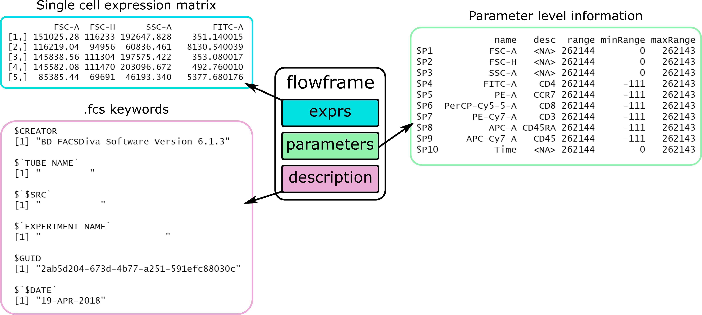
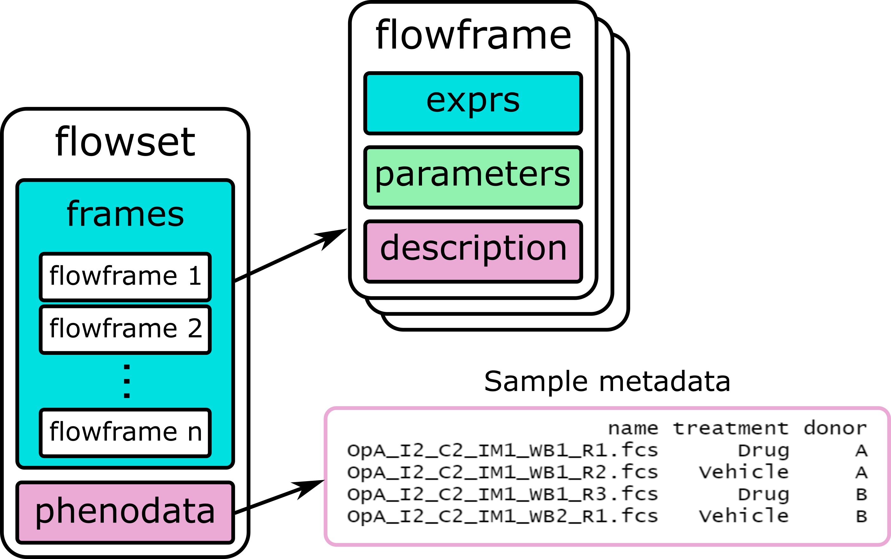

```{r setup, include=FALSE}
knitr::opts_chunk$set(
	echo = TRUE,
	message = FALSE,
	warning = FALSE
)
```

# Why analyse flow cytometry data in R?

With easy to use, graphical tools like FlowJo, FCSExpress and Cytobank, you might wonder why someone would want to manually analyse their flow cytometry data by writing R code. It's true that for most basic cytometry experiments it will be easier and faster to use one of these platforms, but there are benefits to using R:

- It's free and can be run on any computer without a license!
- You can create re-useable analysis scripts that allow others to reproduce your analyses
- Analysis scripts can be automatically run periodically to analyse new screening data in a folder
- Access to a broader range of computational, statistical and plotting tools
- Managing plugins (packages) is usually easier!
- It makes you look cool ;)

# Installing and loading the packages

We'll start by installing all the packages we'll need, and just loading the flowCore and ggcyto packages. FlowCore is the main package needed for reading, writing, and performing basic manipulation of .fcs files in R (even the Spectre package uses it). The ggcyto package provides some convenience functions for plotting cytometry data using ggplot.

We'll use the other packages later, so it's a good idea to install them now.

> Remember that `package::function()` is a way of using a function from an installed package without having to load the whole package.

```{r packages}
# install.packages("BiocManager")
# BiocManager::install("flowCore")
# BiocManager::install("flowWorkspace")
# BiocManager::install("openCyto")
# BiocManager::install("ggcyto")
# BiocManager::install("flowCut")
# devtools::install_github("DillonHammill/CytoExploreR")

library(flowCore)
library(ggcyto)
```

# Working with single .fcs files: flowFrames

We've already seen data structures such as vectors, lists, and data.frames. The flowCore package provides a new data structure to contain data from an .fcs file: the *flowFrame*. You can think of a flowFrame as a container that partitions the information in an .fcs file into three "slots": 

- exprs
- parameter
- description

The exprs slot stands for expression matrix, and is a matrix of the single cell data where each row corresponds to an event, and each column corresponds to a parameter. This is usually the slot we're most interested in.

The parameter slot contains information about each column of the exprs slot. The most useful thing here is usually the *desc* column that contains any labels added to parameters during acquisition.

The description slot is a list containing all of the .fcs *keywords*. This is where all the file metadata is kept, such as the date and time of acquisition, the cytometer model, and PMT voltages.



In the next section I'll show you how to read a single .fcs file into a flowFrame and how we can interact with the data.

## Reading and exploring an .fcs file

To read an .fcs file into R, we use `read.FCS()` from flowCore. If we call the flowFrame object we just created, we get a summary print out telling us the number of events, parameters, keywords, and a print out of the parameters slot showing us which columns we have and their descriptions.

```{r read_fcs}
my_fcs <- read.FCS("data/raw/OpA_I2_C2_IM1_WB1_R1.fcs")
my_fcs 
```

If we want to extract the exprs slot, we can use the `exprs()` function (here I just show the first 10 rows).

```{r exprs}
exprs(my_fcs)[1:10, ]
```

To extract the description slot, we can use the `keywords()` function (here I just show the first 5 keywords). As there are a lot of them, it can be easier to print their names, and then subset the list for the one(s) you want.

```{r keywords}
keyword(my_fcs)[1:5]

names(keyword(my_fcs))

keyword(my_fcs)$SPILL
```

## Removing poor quality events with flowCut

Not all events in a .fcs file are created equally. Events collected during periods of turbulent flow may have erroneously high or low fluorescence values. These periods may also be sparse with data. Removing events from untrustworthy periods of acquisition is important in any analysis to ensure they don't result in false conclusions. The flowClean and flowAI algorithms are two methods for cleaning up flow cytometry files, that are available in flowJo. A newer algorithm, *flowCut* is available in R that seems to remove regions of data that I would consider removing manually myself, so we'll use this instead (with their default parameters I find flowClean can be a little lax, while flowAI can be a little strict).

To apply the flowCut algorithm to a flowFrame, it's as simple as loading the package and calling `flowCut([flowFrame])`. Any files that have events removed get a graphical summary saved in a folder called flowCut under your working directory. The resulting object is a list with four elements:

- The *frame* element is a data.frame containing only the good quality events
- The *ind* element is a vector of the indices of the removed events
- The *data* element is a table summarizing the quality of each sample
- The *worstChan* is the index of the most problematic channel before cleaning

> NOTE: FlowCut isn't yet available as a plugin in FlowJo, so if you want to use flowAI instead to compare results with FlowJo, you can use `flowAI::flow_auto_qc(my_fcs)`.

```{r flowcut}
library(flowCut)
cut_result <- flowCut(my_fcs)

cut_result$frame 
cut_result$data
cut_result$worstChan
```

As we wish to continue working with the cleaned flowFrame, we can extract the frame slot, and store it as a new object.

```{r clean_fcs}
cut_fcs <- cut_result$frame
```

## Compensating an .fcs file

If your panel of fluorophores exhibit spectral overlap with each other, it's important to compensate your data using single colour controls. In this section we're going to compensate our data using the compensation matrix calculated by the instrument during acquisition. This compensation matrix is saved as a keyword in each .fcs file from the experiment. We could also calculate the compensation from scratch (I recommend the AutoSpill algorithm: https://github.com/carlosproca/autospill) or import a compensation matrix from FlowJo.

> NOTE: We are talking about *fluorescence* compensation here. The algorithm used for compensating mass cytometry data is different (it uses non-negative least squares/nnls).

We start by looking to see if the acquisition spillover matrix is saved as a keyword in the .fcs files. To do this we use the `spillover()` function, that just returns the different spillover keywords (different vendors and different .fcs versions use different keywords for the matrix).

```{r spillover}
spillover(cut_fcs)
```

We can see that this .fcs file has its spillover matrix saved inside the `$SPILL` keyword. To compensate the file using this spillover matrix, we use the `compensate()` function, with the flowFrame as the first argument and the spillover matrix as the second argument.

```{r compensate}
comp_fcs <- compensate(cut_fcs, spillover(cut_fcs)[[1]])
```

## Transforming parameter values
Most modern flow cytometers export linear data for all parameters. We usually need to apply some transformation to the fluorescence parameters to visualise the distribution of the data across orders of magnitude.

There are different transformations we can apply. For mass cytometry data the asinh transform is commonly used. For fluorescence cytometry data, the logicle transformation is a logical choice ;).

Let's start by defining the parameters we want to transform, by using the `colnames()` function to get the parameter names in our flowFrame.

Next, we define a transformation using the `estimateLogicle()` function. This function takes a flowFrame and a vector of parameters to transform, and estimates the best cofactors for the logicle transformation for each parameter.

Finally, we apply the transformation we just defined by using the `transform()` function, giving it the flowFrame and the transform object we just defined.

```{r transform}
to_transform <- colnames(comp_fcs)[4:9]
logicle_trans <- estimateLogicle(comp_fcs, to_transform)
trans_fcs <- transform(comp_fcs, logicle_trans)
```

## Plotting data
We can plot our cytometry data using the ggcyto package. This package allows us to use ggplot2 plotting functions with flowFrame objects.

To plot flowFrames, we use the `ggcyto()` function, that works just like the `ggplot()` function does, except that it takes flowFrame objects. We still need to supply our aesthetic mappings, and add geom layers to the plot. In the example below, I use the `geom_hex()` geom, that is similar to a pseudocolour plot in FlowJo. You can adjust the `bins` argument to alter the granularity of the hex plot.

> IMPORTANT: Because the parameter names from this experiment have dashed in them (e.g. FITC-A), we have to wrap them in backticks (top left on your keyboard) so R doesn't interpret this as "FITC minus A".

```{r plotting}
ggcyto(trans_fcs, aes(`FSC-A`, `SSC-A`)) +
    geom_hex(bins = 300)

ggcyto(trans_fcs, aes(`FITC-A`, `PerCP-Cy5-5-A`)) +
    geom_hex(bins = 300)
```

# Working with multiple .fcs files: flowSets
So far I've introduced you to the data structure for holding .fcs data: the flowFrame. But we will rarely work with a single .fcs file at a time, and so the flowCore package provides a data structure for handling multiple flowFrames: the flowSet.

You can think of a flowSet as a container that holds all the flowFrames of an experiment, along with any sample metadata that you wish to include. A flowSet object has two "slots": 

- frames
- phenoData

The frames slot contains the individual flowFrames for each .fcs file. We don't actually have to interact with this slot directly, because just calling `fs[[1]]` will extract the first flowFrame in the flowSet called fs.

> Note that we can subset flowSets in the same way we subset a list.

The phenoData slot contains a data.frame that allows us to add sample metadata. When you first create a flowSet this data.frame will only have a column indicating the name of each sample, but we can freely add columns to indicate treatment, patients, and batches etc.



## Reading files into a flowSet
To create a flowSet, let's first create a vector of the filenames we want to read in. Using the argument `full.names = TRUE` returns full rather than relative file paths.

To read these files into a flowSet, we use `read.flowSet()`, passing the file names as the argument. Calling the flowSet object just prints a message telling us it's a flowSet with 4 experiments (it means flowFrames), the number of columns, and prints the first and last columns so we can see their format.

> NOTE: I'm only reading in the first 4 files here to save time later.

```{r read_flowset}
files <- list.files("data/raw", pattern = ".fcs", full.names = TRUE)
fs <- read.flowSet(files[1:4])
fs
```

If we want to extract an individual flowFrame from a flowSet, we just treat the flowSet like a list and subset using `[[]]`. We can work with these extracted flowFrames exactly as we did before.

```{r extract_frame}
fs[[1]]
```

But rather than extracting individual flowFrames, we will often want to apply operations to each flowFrame in the flowSet. Remember how we can use the `lapply()` function to apply a function to each element of a vector or list? We we can use the `fsApply()` function to apply a function to each flowFrame in a flowSet. For example, let's say we wanted to know the dimensions of each flowFrame (number of events and number of parameters), we could apply the `dim()` function to each flowFrame using `fsApply()`:

```{r fsApply}
fsApply(fs, dim)
```

## Cleaning, compensating, and transforming a flowSet
The `flowCut()` function only accepts one flowFrame at a time as an argument. But we can apply the `flowCut()` function to every flowFrame in our flowSet using `fsApply()`. 

The code below passes each flowFrame to the flowCut algorithm and returns the cleaned flowFrame. The resulting cut_fs object is, conveniently, a new flowSet containing the cleaned flowFrames.

> REMEMBER: We can define a function we're not going to use again on the fly. This is called an *anonymous function*.

```{r}
cut_fs <- fsApply(fs, function(x) {
    flow_cut_res <- flowCut(x)
    flow_cut_res$frame
})
```

To compensate, we need to extract the spillover matrix from one of the files, and use the `compensate()` function to compensate the whole flowSet at once.

> NOTE: It's good practice to check all the files have the same spillover matrix but we won't do that here.

```{r comp_fs}
comp_matrix <- spillover(cut_fs[[1]])[[1]]

comp_fs <- compensate(cut_fs, comp_matrix)
```

To transform, we first need to define our columns and our transform object as before. We can then apply the `transform()` function to the whole flowSet at once.

> Note that, while we can transform the whole flowSet at once, we can only estimate the logicle transform from a single flowFrame (so pick a good one!).

```{r transform_fs}
to_transform <- colnames(comp_fs)[4:9]
logicle_trans <- estimateLogicle(comp_fs[[1]], to_transform)
trans_fs <- transform(comp_fs, logicle_trans)
```

## Plotting a flowSet
When we use `ggcyto()` to plot a flowSet, the function will automatically create separate subplots for each flowFrame. This conveniently let's us compare between samples.

```{r plotting_fs}
ggcyto(trans_fs, aes(`FSC-A`, `SSC-A`)) +
    geom_hex(bins = 200)

ggcyto(trans_fs, aes(`FITC-A`, `PerCP-Cy5-5-A`)) +
    geom_hex(bins = 200)
```

# Manual gating

Just because we're typing, doesn't mean we can't manually gate our data like we do in FlowJo. We can create rectangle, ellipsoid, quadrant, and polygon gates in R just like in any other analysis software. To do this, we're going to load the *flowWorkspace* package that allows us create and keep track of a gating hierarchy, called a *GatingSet*. To create a GatingSet, we just wrap our flowSet inside the `GatingSet()` function.

```{r}
library(flowWorkspace)
gs <- GatingSet(trans_fs)
```

## Rectangle gates
Let's start by gating our cells by scatter, using a rectangle gate. First, we define the coordinates of our gate using the `rectangleGate()` function. We simply give named vectors (using the name of the parameter) of length two, where each element is the lower and upper limit of the rectangle in that axis. We use the `filterId` argument to give this population a name. Calling the object prints some descriptive information about the gate.

```{r rect_scatter}
rect <- rectangleGate("FSC-A" = c(5e4, 1.2e5), "SSC-A" = c(0, 8e4), filterId = "Scatter")
rect
```

To apply our gate to our GatingSet, we use the `gs_pop_add()` function, giving the GatingSet as the first argument, the gate as the second, and the population this gate will be a child of as the `parent` argument.

> NOTE: The ungated data is called "root" (think of the root in a filesystem or the root of a tree).

We can use the `gs_get_pop_paths()` function to print out a hierarchy of our gating, to make sure we've put our gate under the correct parent. The line printed below shows that the Scatter population is a child of root. 

In order for any gate statistics to be calulated (counts and percentages inside the gate), we need to use the `recompute()` function, that just assigns each event to the gates it falls into.

```{r applying_gate}
gs_pop_add(gs, rect, parent = "root")
gs_get_pop_paths(gs)
recompute(gs)
```

## Plotting gates
We're usually going to want to visually check our gate coordinates. We can do this by adding ggcyto's `geom_gate()` layer, specifying the gate we want to visualise.

```{r}
ggcyto(trans_fs, aes(`FSC-A`, `SSC-A`)) +
    geom_hex(bins = 200) +
    geom_gate(rect)
```

A convenient shorthand for this, is to use the `autoplot()` function. A key difference with this function is that we supply the Gating Set *not* the flowSet, and it will draw the gate we specify, including showing us the percentage of events within the gate.

```{r autoplot}
autoplot(gs, x = "FSC-A", y = "SSC-A", gate = "Scatter", bins = 200)
```

## Removing gates
If we decide we want to change a gate, we need to remove it using the `gs_pop_remove()` function, make a change to the gate, then re-add the new gate (followed by `recompute()`).

```{r remove_pop}
gs_pop_remove(gs, "Scatter")
gs_pop_add(gs, rect, parent = "root")
recompute(gs)
```

## Polygon gates
Let's use a polygon gate to exclude doublets. First, we can extract a new flowSet only including events in our initial scatter gate, using the `gs_pop_get_data()` function. We can then use `autoplot()` to help us decide where to draw our gate.

```{r plot_scatter}
scatter_fs <- gs_pop_get_data(gs, "Scatter")
autoplot(scatter_fs, x = "FSC-A", y = "FSC-H", bins = 200)
```

Creating a polygon gate can be a little cumbersome in R. You need to create a matrix containing the coordinates of each of the vertices of your polygon. In the example below, we're creating a polygon gate with four vertices, so I start by creating separate vectors for the x and y axes (these will be FSC-A and FSC-H, respectively).

Next, I use the `matrix()` function to create a matrix where each column corresponds to one of these vectors, and rename the columns to indicate what parameter they represent.


```{r polygon}
x <- c(4e4, 1.2e5, 1e5, 3e4)
y <- c(2.5e4, 9e4, 1.2e5, 5e4)

poly_coords <- matrix(c(x, y), ncol = 2)
colnames(poly_coords) <- c("FSC-A", "FSC-H")
poly_coords
```

To create the polygon gate, we use the `polygonGate()` function, supplying our matrix of coordinates as the first argument, and give a filterID as the second. Then we add this gate to the GatingSet as before.

```{r polygon_gate}
poly <- polygonGate(poly_coords, filterId = "Singlets")
gs_pop_add(gs, poly, parent = "Scatter")
gs_get_pop_paths(gs)
recompute(gs)

autoplot(gs, x = "FSC-A", y = "FSC-H", gate = "Singlets", bins = 200)
```

## Ellipsoid gates
Next, let's gate on our lymphocyte population using an ellipsoid gate around the CD45+ CD3+ events. Again, let's extract the population we're interested in and plot it to help us draw the gate.

```{r plot_singlets}
singlet_fs <- gs_pop_get_data(gs, "Singlets")
autoplot(singlet_fs, x = "APC-Cy7-A", y = "PE-Cy7-A", bins = 200)
```

Creating ellipsoid gates can also be a little cumbersome in R. Because an ellipse can be diagonal, we need to define a *covariance matrix* and a vector of means, in order to create an ellipsoid gate.

> NOTE: Covariance is just unstandardized correlation. If you want to create an ellipse that has a correlation between the two parameters (i.e. it is tilted or diagonal), you need to add some covariance. If you want to create an ellipse that shows no correlation between two parameters, leave the covariances 0 and just set the variance for each parameter individually (this sets the width of the ellipse in each axis).

In this example, we want an ellipse to encircle the CD45+ CD3+ events. As this population is not diagonal, we can set the covariance values in our matrix to 0, and just set the variances to control how wide the ellipse is around its mean. In the example below, I create a matrix where the variances in the x and y axes are both 0.5, and the covariance is 0. I label the row and column names using the `dimnames` argument. 

If this code is difficult to interpret, print out the matrix and see if it makes sense. The diagonal elements indicate the variance of the ellipse in each axis, and the off diagonal elements indicate the covariance between the axes.

We then create a vector of means that will indicate the center of the ellipse in each axis.

```{r cov_matrix}
cov_mat <- matrix(c(0.5, 0, 0, 0.5), 
                  ncol = 2,
                  dimnames = list(c("APC-Cy7-A", "PE-Cy7-A"), 
                                  c("APC-Cy7-A", "PE-Cy7-A")))

cov_mat

means <- c("APC-Cy7-A" = 3.5, "PE-Cy7-A" = 3.8)
```

To create our ellipsoid gate, we use the `ellipsoidGate()` function, supplying the covariance matrix we created, the vector of means, and a filterId. We add and plot this gate just like the others.

```{r add_ellipse}
ellipse <- ellipsoidGate(cov_mat, mean = means, filterId = "CD3")
gs_pop_add(gs, ellipse, parent = "Singlets")
gs_get_pop_paths(gs)
recompute(gs)

autoplot(gs, x = "APC-Cy7-A", y = "PE-Cy7-A", gate = "CD3", bins = 200)
```

# Sample-specific gating

Sometimes, rather than having the same gate cordinates applied across all samples, we might want to create gates that adapt to each individual sample. There are several ways we can do this, but the openCyto package gives us a few sample-specific gating tools we can use, in particular, the `gate_flowclust_2d()` function that automatically gates 2D clusters of events.

```{r open_cyto}
library(openCyto)
```

We're going to draw gates on our CD4+ and CD8+ cells, so let's start by plotting these antigens against each other.

```{r extract_cd3}
cd3_fs <- gs_pop_get_data(gs, "CD3")
autoplot(cd3_fs, x = "FITC-A", y = "PerCP-Cy5-5-A", bins = 200)
```

## Gating CD8+ events

Let's start with the CD8 gate. To create sample specific gating, we simply use `fsApply()` to apply the `gate_flowclust_2d()` function separately to each flowFrame in the cd3_fs flowSet.

The first argument of the `gate_flowclust_2d()` function is the flowFrame (here represented by x because we are iterating over each element of the flowSet). Then, we specify the 2 channels needed to define the gate. The `target` argument is a vector indicating the approximate x and y means of where we think the population lies. The `min` optional argument prevents values smaller than these x and y axis values from influencing the ellipse (there is a similar `max` argument). The `quantile` argument allows us to shrink the ellipse to be more or less stringent. Smaller values result in tighter gates.

> NOTE: It took me a bit of trial and error to come to these parameters.

```{r cd8}
cd8_auto <- fsApply(cd3_fs, function(x) {
    gate_flowclust_2d(x, 
                      xChannel = "FITC-A", 
                      yChannel = "PerCP-Cy5-5-A",
                      target = c(1, 3.5), 
                      min = c(-1, 2.5), 
                      quantile = 0.9)
})
```

The resulting object is a list of ellipsoid gates (one for each flowFrame). This is useful, because when we give a list of gates to the `gs_pop_add()` function, it knows to apply each gate element-wise to each flowFrame. Look closely at the plots, the gates are slightly different for each sample.

```{r add_cd8}
gs_pop_add(gs, cd8_auto, parent = "CD3", name = "CD8")
recompute(gs)
autoplot(gs, x = "FITC-A", y = "PerCP-Cy5-5-A", gate = "CD8", bins = 200)
```

## Gating CD4+ events
Let's do the same thing for the CD4 gate. This time I use the `max` argument (rather than the `min`), and set the optional argument `K` to 3. This asks the function to look for 3 clusters and select the one closest to my values of the `target` argument.

```{r cd4}
cd4_auto <- fsApply(cd3_fs, function(x) {
    gate_flowclust_2d(x, xChannel = "FITC-A", yChannel = "PerCP-Cy5-5-A",
                      target = c(2.8, 0.5), 
                      max = c(4, 2),
                      K = 3,
                      quantile = 0.975)
})

gs_pop_add(gs, cd4_auto, parent = "CD3", name = "CD4")
recompute(gs)
autoplot(gs, x = "FITC-A", y = "PerCP-Cy5-5-A", gate = "CD4", bins = 200)
```

# Plotting the gating strategy
This gating strategy is very simple, but it can be helpful to graphically summarise more complex gating strategies to make sure the hierarchy is correct. This is easily done by calling `plot()` on a GatingSet.

```{r plot_gs}
plot(gs)
```

To plot the entire gating strategy for one sample, we can call `autoplot()` on our GatingSet object, subsetting for the flowFrame we want.

```{r plot_strategy}
autoplot(gs[[1]], bins = 200)
```

To save images of the gating strategy for all flowFrames, we can use `lapply()` to iterate over each flowFrame and open a .png file, print the plot to it, and close the file again (`dev.off()`).

```{r png_strategies}
lapply(1:4, function(x) {
    png(paste0("plots/", x, "_gating.png"))
    print(autoplot(gs[[x]], bins = 200))
    dev.off()
})
```

# Extracting population statistics

Now that we've finished gating our data, we probably want to extract some summary statistics per sample, per gate. We can do this using the `gs_pop_get_stats()` function, by supplying the GatingSet and the argument `type` that defines what sort of statistics we want. The `type` argument can either be:

- "count" for population counts
- "percent" for percentages of parent
- pop.MFI for median fluorescence intensity
- a custom function

Irritatingly, the default options of "count", "percent", and pop.MFI need to be computed separately and then combined together using `cbind()` (to bind data.frames together by columns) if you want all of them.

```{r pop_stats}
pop_stats <- gs_pop_get_stats(gs, type = "count")
pop_stats$percent <- gs_pop_get_stats(gs, type = "percent")$percent

medians <- gs_pop_get_stats(gs, type = pop.MFI)[, 3:8]
pop_stats <- cbind(pop_stats, medians)
pop_stats
```

If, instead of returning statistics for all populations, you wanted only one or a subset, you can supply a vector of population names to the `nodes` argument.

```{r}
gs_pop_get_stats(gs, nodes = c("CD4", "CD8"), type = pop.MFI)
```

If you want to, you can save the summary statistics as a .csv file.

```{r write_csv}
write.csv(pop_stats, "Summary statistics.csv")
```

# Exporting gated populations as .fcs files
If you want to export a particular population as fresh .fcs files, you can do so using the `write.flowSet()` function after extracting the population of interest with `gs_pop_get_data()`. The first argument of `write.flowSet()` is the flowSet, and the second argument is the directory the files will be saved in. There will be a separate .fcs file for each flowFrame in the flowSet.

```{r write_fcs}
cd3_fs <- gs_pop_get_data(gs, "CD3")
write.flowSet(cd3_fs, "output")
```